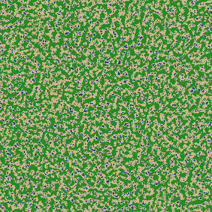

# AuraGraphia

**AuraGraphia** è un generatore procedurale di mappe 2D scritto in Python. Utilizza l'algoritmo **Simplex Noise** per creare paesaggi naturali coerenti, completi di biomi diversificati basati sull'elevazione.

Il progetto è nato con l'obiettivo di esplorare la generazione procedurale e la manipolazione di immagini tramite codice, mantenendo una struttura modulare e pulita.

## Funzionalità

* **Generazione Infinita**: Grazie all'uso dei *Seed*, ogni mappa è unica ma riproducibile.
* **Sistema di Biomi**: Identificazione automatica di Oceano, Spiaggia, Foresta e Montagna in base ai valori di rumore.
* **Rendering Grafico**: Esportazione automatica in formato `.png` nella cartella `output/`.
* **Batch Processing**: Possibilità di generare più mappe contemporaneamente definendo dimensioni e scala via terminale.
* **Architettura Modulare**: Separazione netta tra logica matematica e rendering estetico.

## Architettura del Software

Il progetto è diviso in tre moduli principali per garantire scalabilità e leggibilità:

1.  **`logic.py`**: Gestisce la creazione della matrice e il calcolo del rumore (Perlin/Simplex).
2.  **`render.py`**: Si occupa della conversione dei dati numerici in pixel colorati utilizzando la libreria Pillow.
3.  **`main.py`**: L'entry point del programma che gestisce l'interazione con l'utente e coordina i moduli.

## Esempi




## Installazione

Assicurati di avere Python installato. Poi, installa le dipendenze necessarie:

```bash
pip install -r requirements.txt

